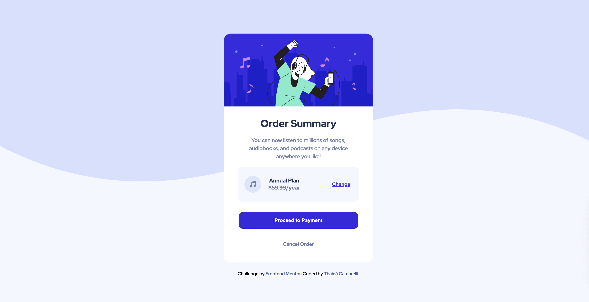

# Frontend Mentor - Order summary card solution

This is a solution to the [Order summary card challenge on Frontend Mentor](https://www.frontendmentor.io/challenges/order-summary-component-QlPmajDUj). Frontend Mentor challenges help you improve your coding skills by building realistic projects. 

## Table of contents

- [Overview](#overview)
  - [The challenge](#the-challenge)
  - [Screenshot](#screenshot)
  - [Links](#links)
- [My process](#my-process)
  - [Built with](#built-with)
  - [What I learned](#what-i-learned)
  - [Continued development](#continued-development)
  - [Useful resources](#useful-resources)
- [Author](#author)
- [Acknowledgments](#acknowledgments)

## Overview

### Screenshot



### Links

- Solution URL: [URL](https://thaicamarelli.github.io/order-summary-component/)

## My process

### Built with

- Semantic HTML5 markup
- CSS custom properties

### What I learned

```css
body{
    background:url(./images/pattern-background-desktop.svg) no-repeat;
}
```

## Author

- Frontend Mentor - [@thaicamrelli](https://www.frontendmentor.io/profile/yourusername)


